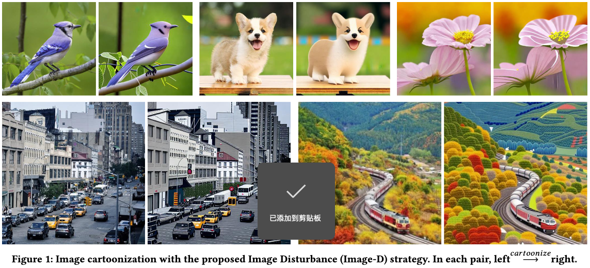
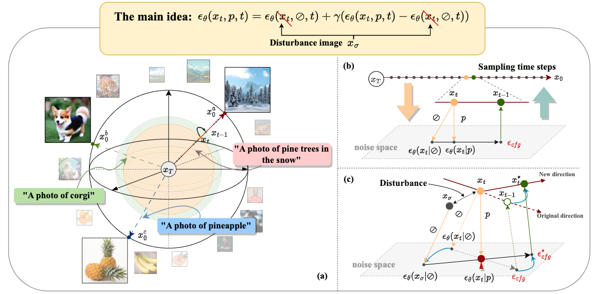
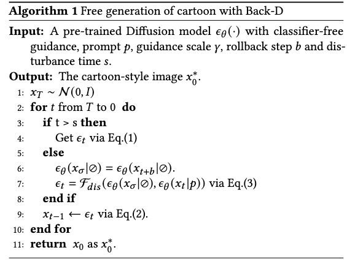
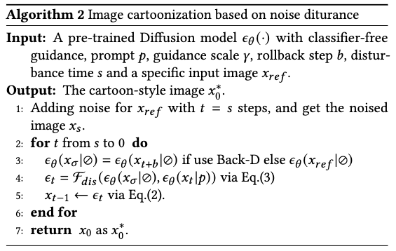

# Null-text Guidance in Diffusion Models is Secretly a Cartoon-style Creator
--------



# Abstract
Classifier-free guidance is an effective sampling technique in diffusion models that has been widely adopted. The main idea is to extrapolate the model in the direction of text guidance and away from null-text guidance. In this paper, we demonstrate that null-text guidance in diffusion models is secretly a cartoon-style creator, i.e., the generated images can be efficiently transformed into cartoons by simply perturbing the null-text guidance. Specifically, we proposed two disturbance methods, i.e., Rollback disturbance (Back-D) and Image disturbance (Image-D), to construct misalignment between the noisy images used for predicting null-text guidance and text guidance (subsequently referred to as null-text noisy image and text noisy image respectively) in the sampling process. Back-D achieves cartoonization by altering the noise level of null-text noisy image via replacing $x_t$ with $x_{t+\Delta t}$. Image-D, alternatively, produces high-fidelity, diverse cartoons by defining $x_t$ as a clean input image, which further improves the incorporation of finer image details. Through comprehensive experiments, we delved into the principle of noise disturbing for null-text and uncovered that the efficacy of disturbance depends on the correlation between the null-text noisy image and the source image. Moreover, our proposed techniques, which can generate cartoon images and cartoonize specific ones, are training-free and easily integrated as a plug-and-play component in any classifier-free guided diffusion model. Project page is available at <https://nulltextforcartoon.github.io>.

# Method




# Requirements
A suitable conda environment named ldm can be created and activated with:

```
conda env create -f environment.yaml
conda activate ldm
```

You can also update an existing latent diffusion environment by running:
```
conda install pytorch torchvision -c pytorch
pip install transformers==4.19.2 diffusers invisible-watermark
pip install -e .
```


To get started, install the additionally required python packages into your ldm environment.
```
pip install safetensors==0.3.0 omegaconf==2.1.1 tqdm==4.64.0 einops==0.6.0 pytorch_lightning==1.6.0 scikit-learn==0.24.2 matplotlib==3.4.2 
```

# Try cartoonization
You can grab the stable diffusion model ```sd-v1-4-full-ema.ckpt``` from <https://huggingface.co/CompVis/stable-diffusion-v-1-4-original> and make sure to put it in the root path. 
run:
```
python cartoonization.py --ckpt 'sd-v1-4-full-ema.ckpt' --n_samples 8 --mode 1 --prompt "a photo of bird" --image_path "bird03.png"
```

where:
```
mode = 0 : Stable diffusion (baseline)
mode = 1 : Free generation with Rollback disturbance
mode = 2 : Image Cartoonization with Rollback disturbance
mode = 3 : Image Cartoonization with Image disturbance
```